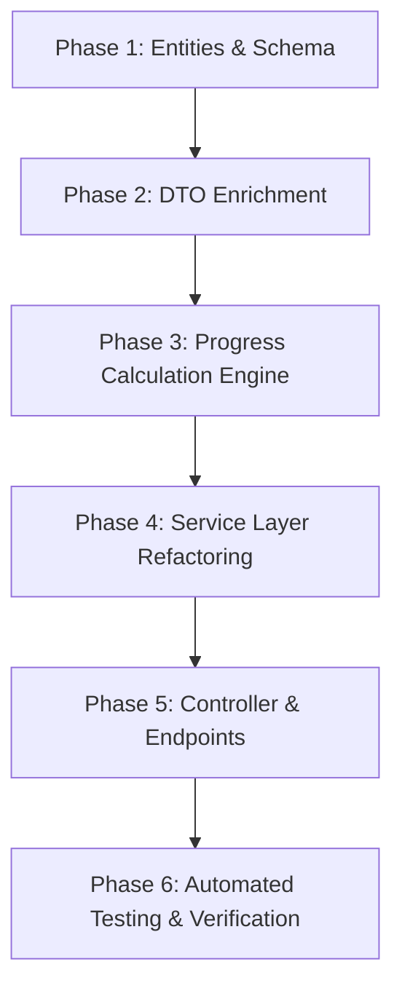

# Backend Implementation Plan — Player (Trainee) Page

> **Document Status:** Implementation-Ready  
> **Target System:** `aiki-backend` (Spring Boot, Java 21, JPA/Hibernate, PostgreSQL)  
> **Source Spec:** [`aikichun-progress/docs/player-page-spec.md`](file:///d:/Software/Aiki/aiki-project/aikichun-progress/docs/player-page-spec.md)  
> **Target Date:** 2026-10-09  

---

## 1. Executive Summary & Goals

This plan specifies the backend modifications required in `aiki-backend` to fully support the **Player (Trainee) Page**. The backend must deliver a rich, hierarchical, server-calculated view of the trainee's learning roadmap (`Levels → Steps → Tasks`) with dynamic check-based progress, zero-check task exclusion, inactive task filtering, and configurable access control (`OPEN` vs `PROGRESSIVE`).

### Key Objectives
1. **Server-Side Hierarchy & Progress Computation**: Deliver all progress metrics (`level.progressPercentage`, `stage.progressPercentage`, `stage.percentageOfLevel`, `level.stepsCount`, `overallProgressPercentage`) in a single `GET /api/v1/trainee/{traineeId}/roadmap` response.
2. **Dynamic Check Integration**: Ensure all task progress reflects dynamic `CheckDefinition` items (via `TraineeTaskCheckProgress`), removing legacy competency hardcoding from trainee roadmap representations.
3. **Access Control (Level Locking)**: Add `accessMode` (`OPEN` | `PROGRESSIVE`) to `Roadmap` entity and compute `isLocked` per level in the hierarchy response.
4. **Zero-Check & Inactive Filtering**: Exclude inactive tasks completely and exclude zero-check tasks from step/level weight denominators while displaying them gracefully.
5. **Instant Check Toggle Verification**: Ensure `PUT /api/v1/trainee/{traineeId}/tasks/{taskId}/checks/{checkDefinitionId}` responds with complete updated task progress for seamless optimistic UI updates.

---

## 2. Architecture & Mathematical Formulas

### 2.1 Progress Calculation Formulas

$$\text{Task Progress } \% = \begin{cases} \frac{\text{completedChecks}}{\text{assignedChecks}} \times 100 & \text{if } \text{assignedChecks} > 0 \\ 0.00 & \text{if } \text{assignedChecks} = 0 \end{cases}$$

$$\text{Step Progress } \% = \begin{cases} \frac{\sum_{t \in \text{ActiveTasks}, \text{checks}(t) > 0} (W_t \times \text{taskFraction}_t)}{\sum_{t \in \text{ActiveTasks}, \text{checks}(t) > 0} W_t} \times 100 & \text{if } \sum W_t > 0 \\ 0.00 & \text{if no tasks with checks} \end{cases}$$

$$\text{Step Contribution to Level } (\text{percentageOfLevel}) = \begin{cases} \frac{W_{\text{stage}}}{\sum_{s \in \text{LevelStages}} W_s} \times 100 & \text{if } \sum W_s > 0 \\ 0.00 & \text{otherwise} \end{cases}$$

$$\text{Level Progress } \% = \begin{cases} \frac{\sum_{s \in \text{LevelStages}} (W_s \times \text{stepFraction}_s)}{\sum_{s \in \text{LevelStages}} W_s} \times 100 & \text{if } \sum W_s > 0 \\ 0.00 & \text{otherwise} \end{cases}$$

$$\text{Roadmap Overall Progress } \% = \begin{cases} \frac{\sum_{l \in \text{ActiveLevels}} (W_l \times \text{levelFraction}_l)}{\sum_{l \in \text{ActiveLevels}} W_l} \times 100 & \text{if } \sum W_l > 0 \\ 0.00 & \text{otherwise} \end{cases}$$

*All fractions are in range $[0.0, 1.0]$. All percentages are scaled to 2 decimal places with `RoundingMode.HALF_UP`.*

---

## 3. Implementation Phases & File Matrix



---

## 4. Phase 1: Entity & Schema Modifications

### 1.1 New Enum: `AccessMode`
Create file: `aiki-backend/src/main/java/com/aiki/manage/domain/roadmap/entity/AccessMode.java`

```java
package com.aiki.manage.domain.roadmap.entity;

public enum AccessMode {
    OPEN,
    PROGRESSIVE
}
```

### 1.2 Modify Entity: `Roadmap`
File: [`Roadmap.java`](file:///d:/Software/Aiki/aiki-project/aiki-backend/src/main/java/com/aiki/manage/domain/roadmap/entity/Roadmap.java)

- Add column `access_mode`:
  ```java
  @Enumerated(EnumType.STRING)
  @Column(name = "access_mode", nullable = false, length = 30)
  @Builder.Default
  private AccessMode accessMode = AccessMode.OPEN;
  ```

### 1.3 Modify Entity: `Level`
File: [`Level.java`](file:///d:/Software/Aiki/aiki-project/aiki-backend/src/main/java/com/aiki/manage/domain/roadmap/entity/Level.java)

- Add optional column `description`:
  ```java
  @Column(name = "description", columnDefinition = "TEXT")
  private String description;
  ```

---

## 5. Phase 2: DTO Enhancements

### 2.1 Enrich `TraineeLevelResponse`
File: [`TraineeLevelResponse.java`](file:///d:/Software/Aiki/aiki-project/aiki-backend/src/main/java/com/aiki/manage/domain/roadmap/dto/TraineeLevelResponse.java)

Add fields:
- `private BigDecimal progressPercentage;`
- `private int stepsCount;`
- `private String description;`
- `private boolean isLocked;`
- Add `@JsonProperty("isLocked")` getters/setters.

```java
package com.aiki.manage.domain.roadmap.dto;

import com.fasterxml.jackson.annotation.JsonProperty;
import lombok.AllArgsConstructor;
import lombok.Builder;
import lombok.Data;
import lombok.NoArgsConstructor;

import java.math.BigDecimal;
import java.util.ArrayList;
import java.util.List;

@Data
@Builder
@NoArgsConstructor
@AllArgsConstructor
public class TraineeLevelResponse {
    private Long id;
    private Long roadmapId;
    private String name;
    private String description;
    private String link;
    private BigDecimal weight;
    private int position;
    private BigDecimal progressPercentage;
    private int stepsCount;

    @JsonProperty("isLocked")
    private boolean isLocked;

    @Builder.Default
    private List<TraineeStageResponse> stages = new ArrayList<>();

    @JsonProperty("isLocked")
    public boolean isLocked() {
        return isLocked;
    }

    @JsonProperty("isLocked")
    public void setLocked(boolean isLocked) {
        this.isLocked = isLocked;
    }
}
```

### 2.2 Enrich `TraineeStageResponse`
File: [`TraineeStageResponse.java`](file:///d:/Software/Aiki/aiki-project/aiki-backend/src/main/java/com/aiki/manage/domain/roadmap/dto/TraineeStageResponse.java)

Add fields:
- `private BigDecimal progressPercentage;`
- `private BigDecimal percentageOfLevel;`

```java
package com.aiki.manage.domain.roadmap.dto;

import lombok.AllArgsConstructor;
import lombok.Builder;
import lombok.Data;
import lombok.NoArgsConstructor;

import java.math.BigDecimal;
import java.util.ArrayList;
import java.util.List;

@Data
@Builder
@NoArgsConstructor
@AllArgsConstructor
public class TraineeStageResponse {
    private Long id;
    private Long levelId;
    private PriorityStageResponse priorityStage;
    private String code;
    private String name;
    private String link;
    private BigDecimal weight;
    private int position;
    private BigDecimal progressPercentage;
    private BigDecimal percentageOfLevel;
    @Builder.Default
    private List<TraineeStageTaskResponse> tasks = new ArrayList<>();
}
```

### 2.3 Enrich `TraineeRoadmapHierarchyResponse` & `RoadmapHierarchyResponse`
Files:
- [`TraineeRoadmapHierarchyResponse.java`](file:///d:/Software/Aiki/aiki-project/aiki-backend/src/main/java/com/aiki/manage/domain/roadmap/dto/TraineeRoadmapHierarchyResponse.java)
- [`RoadmapHierarchyResponse.java`](file:///d:/Software/Aiki/aiki-project/aiki-backend/src/main/java/com/aiki/manage/domain/roadmap/dto/RoadmapHierarchyResponse.java)
- [`RoadmapRequest.java`](file:///d:/Software/Aiki/aiki-project/aiki-backend/src/main/java/com/aiki/manage/domain/roadmap/dto/RoadmapRequest.java)
- [`LevelRequest.java`](file:///d:/Software/Aiki/aiki-project/aiki-backend/src/main/java/com/aiki/manage/domain/roadmap/dto/LevelRequest.java)
- [`LevelResponse.java`](file:///d:/Software/Aiki/aiki-project/aiki-backend/src/main/java/com/aiki/manage/domain/roadmap/dto/LevelResponse.java)

Add `accessMode` (`AccessMode`) to `TraineeRoadmapHierarchyResponse`, `RoadmapHierarchyResponse`, and `RoadmapRequest`. Add `description` to `LevelRequest` and `LevelResponse`.

---

## 6. Phase 3: Progress Calculation Engine Extension

File: [`DynamicProgressEngine.java`](file:///d:/Software/Aiki/aiki-project/aiki-backend/src/main/java/com/aiki/manage/domain/progress/engine/DynamicProgressEngine.java)

Add reusable static calculation methods for:
1. **`calculatePercentage(BigDecimal part, BigDecimal total)`**: Safe division yielding a scaled percentage `0.00` to `100.00`.
2. **`calculateStagePercentageOfLevel(BigDecimal stageWeight, BigDecimal totalLevelStagesWeight)`**.
3. **`calculateStageProgress(List<TaskProgressItem> tasks)`**: Weighted task aggregation excluding zero-check tasks and inactive tasks.
4. **`calculateLevelProgress(List<StageProgressItem> stages)`**: Weighted stage aggregation.

```java
public static BigDecimal calculatePercentage(BigDecimal part, BigDecimal total) {
    if (total == null || total.compareTo(BigDecimal.ZERO) <= 0 || part == null || part.compareTo(BigDecimal.ZERO) <= 0) {
        return BigDecimal.ZERO.setScale(2, RoundingMode.HALF_UP);
    }
    return part.divide(total, 6, RoundingMode.HALF_UP)
            .multiply(BigDecimal.valueOf(100))
            .setScale(2, RoundingMode.HALF_UP);
}
```

---

## 7. Phase 4: Service Layer Refactoring

### 4.1 Update `RoadmapService.getTraineeRoadmapHierarchy(traineeId)`
File: [`RoadmapService.java`](file:///d:/Software/Aiki/aiki-project/aiki-backend/src/main/java/com/aiki/manage/domain/roadmap/service/RoadmapService.java)

#### Step-by-Step Logic Flow:
1. **Fetch Active Roadmap**: Retrieve the active roadmap with levels and stages.
2. **Batch Load Task Definitions & Assigned Checks**:
   - Collect all active `Task` IDs across all stages.
   - Batch query `taskCheckAssignmentRepository.findByTaskIdInWithDefinition(activeTaskIds)` to produce `Map<Long, List<CheckDefinitionResponse>>`.
3. **Batch Load Trainee Progress**:
   - Fetch `traineeProgressService.getProgressMapForTrainee(traineeId, activeTaskIds)`.
4. **Hierarchical Trainee Hierarchy Assembly & Math**:
   - **For each Level**:
     - Compute total stage weight in level: $\sum W_{\text{stage}}$.
     - Track `earnedLevelPoints = 0.0`.
     - Track `totalLevelWeightForProgress = 0.0`.
     - **For each Stage**:
       - Calculate `percentageOfLevel = DynamicProgressEngine.calculatePercentage(stage.getWeight(), totalStageWeightInLevel)`.
       - Filter active tasks (`task.isActive()`).
       - Calculate total task weight for tasks with $\ge 1$ check: $\sum W_{\text{task, with checks}}$.
       - Calculate earned task points in stage: $\sum (W_{\text{task}} \times \frac{\text{completedChecks}}{\text{totalChecks}})$.
       - Compute `stage.progressPercentage = calculatePercentage(earnedTaskPoints, totalTaskWeightWithChecks)`.
       - Map task responses with populated check definitions in `TaskResponse.fromEntity(task, checks)`.
       - Add to level points: `earnedLevelPoints += stage.getWeight() * (stage.progressPercentage / 100)`.
     - Compute `level.progressPercentage = calculatePercentage(earnedLevelPoints, totalStageWeightInLevel)`.
     - Compute `level.stepsCount = stageResponses.size()`.
5. **Access Control & Locking Resolution**:
   - If `roadmap.getAccessMode() == AccessMode.OPEN`:
     - All levels have `isLocked = false`.
   - If `roadmap.getAccessMode() == AccessMode.PROGRESSIVE`:
     - Identify the first incomplete level (the lowest position level with `progressPercentage < 100.00`).
     - Levels with `position <= currentUnlockedLevel.position` are unlocked (`isLocked = false`).
     - Levels with `position > currentUnlockedLevel.position` are locked (`isLocked = true`).
     - For locked levels, stages are retained for overview but tasks are optionally hidden or marked locked as specified.
6. **Overall Roadmap Progress**:
   - Use `traineeProgressService.calculateRoadmapProgress(traineeId, roadmap.getId())`.
   - Return populated `TraineeRoadmapHierarchyResponse`.

### 4.2 Update `LevelService` & `RoadmapService` for Admin/Coach Updates
- Update `LevelService.createLevel` and `updateLevel` to persist `description`.
- Update `RoadmapService.updateRoadmap` to persist `accessMode`.

---

## 8. Phase 5: Controller & Endpoint Verification

### 8.1 Trainee Roadmap Hierarchy Endpoint
- **Method**: `GET /api/v1/trainee/{traineeId}/roadmap`
- **Controller**: [`TraineeRoadmapController.java`](file:///d:/Software/Aiki/aiki-project/aiki-backend/src/main/java/com/aiki/manage/domain/roadmap/controller/TraineeRoadmapController.java)
- **Response**: `TraineeRoadmapHierarchyResponse` with full nested progress percentages and lock states.

### 8.2 Trainee Check Toggle Endpoint
- **Method**: `PUT /api/v1/trainee/{traineeId}/tasks/{taskId}/checks/{checkDefinitionId}`
- **Controller**: [`TraineeProgressController.java`](file:///d:/Software/Aiki/aiki-project/aiki-backend/src/main/java/com/aiki/manage/domain/progress/controller/TraineeProgressController.java)
- **Body**: `TraineeCheckProgressRequest { "completed": true }`
- **Response**: `TraineeTaskProgressResponse` containing updated `completedChecksCount`, `totalChecksCount`, `progressPercentage`, `status`, and `checks[]`.

---

## 9. Phase 6: Automated Testing & Verification Plan

### 9.1 Unit Tests — `ProgressAndRoadmapBusinessRulesTest`
File: [`ProgressAndRoadmapBusinessRulesTest.java`](file:///d:/Software/Aiki/aiki-project/aiki-backend/src/test/java/com/aiki/manage/domain/progress/service/ProgressAndRoadmapBusinessRulesTest.java)

Add comprehensive tests for:
1. **Zero-Check Tasks Exclusion**:
   - Stage with Task A (weight 20, 2/2 checks completed) and Task B (weight 30, 0 checks assigned).
   - Assert Step progress is `100.00%` (not diluted by Task B).
2. **Inactive Task Exclusion**:
   - Inactive tasks (`active = false`) are ignored in both numerator and denominator.
3. **Hierarchical Weighted Calculation**:
   - Verify step progress %, step % of level, level progress %, and overall roadmap %.
4. **Access Control Locking (`OPEN` vs `PROGRESSIVE`)**:
   - In `OPEN` mode: all 3 levels unlocked.
   - In `PROGRESSIVE` mode: Level 1 (100% complete) → unlocked, Level 2 (50% complete) → unlocked, Level 3 (0% complete) → locked (`isLocked = true`).

### 9.2 Service & Controller Integration Tests
1. `RoadmapServiceTest`: Verify `getTraineeRoadmapHierarchy` returns correctly structured DTOs with populated `checks` on `TaskResponse` and calculated progress fields.
2. `TraineeRoadmapControllerTest`: Verify JSON serialization format conforms exactly to `player-page-spec.md §6.3`.

---

## 10. File Modification Summary Checklist

| # | File Path | Action | Description |
|---|-----------|--------|-------------|
| 1 | `domain/roadmap/entity/AccessMode.java` | **CREATE** | Enum for `OPEN` vs `PROGRESSIVE` access mode |
| 2 | `domain/roadmap/entity/Roadmap.java` | **MODIFY** | Add `accessMode` column (default `OPEN`) |
| 3 | `domain/roadmap/entity/Level.java` | **MODIFY** | Add `description` column |
| 4 | `domain/roadmap/dto/TraineeLevelResponse.java` | **MODIFY** | Add `progressPercentage`, `stepsCount`, `description`, `isLocked` |
| 5 | `domain/roadmap/dto/TraineeStageResponse.java` | **MODIFY** | Add `progressPercentage`, `percentageOfLevel` |
| 6 | `domain/roadmap/dto/TraineeRoadmapHierarchyResponse.java` | **MODIFY** | Add `accessMode` field |
| 7 | `domain/roadmap/dto/RoadmapRequest.java` | **MODIFY** | Add `accessMode` field |
| 8 | `domain/roadmap/dto/RoadmapHierarchyResponse.java` | **MODIFY** | Add `accessMode` field |
| 9 | `domain/roadmap/dto/LevelRequest.java` | **MODIFY** | Add `description` field |
| 10 | `domain/roadmap/dto/LevelResponse.java` | **MODIFY** | Add `description` field |
| 11 | `domain/progress/engine/DynamicProgressEngine.java` | **MODIFY** | Add percentage and aggregation helper methods |
| 12 | `domain/roadmap/service/RoadmapService.java` | **MODIFY** | Enrich `getTraineeRoadmapHierarchy` with checks and hierarchy progress calculation |
| 13 | `domain/roadmap/service/LevelService.java` | **MODIFY** | Handle `description` in `createLevel` and `updateLevel` |
| 14 | `src/test/.../ProgressAndRoadmapBusinessRulesTest.java` | **MODIFY** | Add test cases for hierarchy calculation, zero-check exclusion, and locking |

---

## 11. Next Step & Execution Order

Once approved, execution will proceed in 4 ordered commits:
1. **Entities & DTOs**: Create `AccessMode`, update `Roadmap`, `Level`, and all DTOs.
2. **Engine & Service**: Implement calculation logic in `DynamicProgressEngine` and update `RoadmapService.getTraineeRoadmapHierarchy`.
3. **Admin Service updates**: Update `LevelService` and `RoadmapService` to handle `description` and `accessMode`.
4. **Unit & Integration Tests**: Run existing test suite and add comprehensive business rule test cases.
