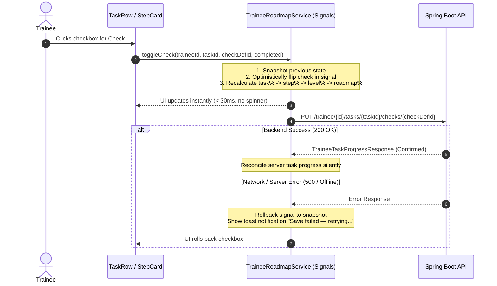
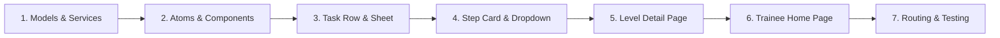

# Frontend Implementation Plan & API Contract — Player (Trainee) Page

> **Document Status:** Implementation-Ready  
> **Target Framework:** Angular 19+ (Standalone Components, Signals, Vanilla CSS)  
> **Target System:** `aikichun-progress`  
> **Source Spec:** [`aikichun-progress/docs/player-page-spec.md`](file:///d:/Software/Aiki/aiki-project/aikichun-progress/docs/player-page-spec.md)  
> **Backend Reference:** [`aikichun-progress/docs/player-page-backend-plan.md`](file:///d:/Software/Aiki/aiki-project/aikichun-progress/docs/player-page-backend-plan.md)  
> **Date:** 2026-10-09  

---

## 1. Complete API Contract

All endpoints run against the base URL `http://localhost:8080/api/v1` (configured via `environment.apiUrl`).

### 1.1 Trainee Roadmap Hierarchy

Retrieve the complete active curriculum hierarchy tailored for the trainee with server-calculated progress and lock states.

- **Endpoint:** `GET /api/v1/trainee/{traineeId}/roadmap`
- **Path Parameter:** `traineeId` (`Long` / `number`) — The ID of the authenticated trainee.
- **Success Status:** `200 OK`
- **Response Headers:** `Content-Type: application/json`

#### Response JSON Schema:
```json
{
  "id": 1,
  "name": "Full Spectrum Aikido & Defense",
  "description": "Comprehensive journey from foundational principles to master proficiency",
  "isActive": true,
  "accessMode": "OPEN", // "OPEN" | "PROGRESSIVE"
  "progressSummary": {
    "traineeId": 42,
    "roadmapId": 1,
    "overallProgressPercentage": 37.50,
    "totalCurriculumWeight": 100.00,
    "earnedWeightedPoints": 37.50,
    "totalTasksCount": 24,
    "completedTasksCount": 8,
    "inProgressTasksCount": 4
  },
  "levels": [
    {
      "id": 10,
      "roadmapId": 1,
      "name": "Level 1 — Stances & Ukemi",
      "description": "Mastering balance, foundational movement, and breakfalls.",
      "link": "https://resources.aiki.internal/level-1",
      "weight": 30.00,
      "position": 1,
      "progressPercentage": 66.67,
      "stepsCount": 2,
      "isLocked": false,
      "stages": [
        {
          "id": 100,
          "levelId": 10,
          "code": "SG1-001",
          "name": "Forward Roll (Mae Ukemi)",
          "link": "https://video.aiki.internal/rolls",
          "weight": 50.00,
          "position": 1,
          "progressPercentage": 100.00,
          "percentageOfLevel": 50.00,
          "priorityStage": {
            "id": 1,
            "name": "Core Foundation",
            "color": "#22c55e",
            "description": "Essential movement required for all subsequent techniques."
          },
          "tasks": [
            {
              "id": 501,
              "stageId": 100,
              "position": 1,
              "isMain": true,
              "task": {
                "id": 1001,
                "code": "T-01",
                "title": "Low Knee Roll Execution",
                "description": "Execute smooth roll from kneeling posture keeping chin tucked.",
                "link": "https://docs.aiki.internal/roll-guide.pdf",
                "weight": 20.00,
                "active": true,
                "checks": [
                  { "id": 1, "name": "Mechanics", "description": "Tucked chin and rounded shoulder" },
                  { "id": 2, "name": "Flow", "description": "Silent landing with no hard contact" }
                ],
                "createdAt": "2026-10-09T18:00:00Z",
                "updatedAt": "2026-10-09T18:00:00Z"
              },
              "progress": {
                "id": null,
                "traineeId": 42,
                "taskId": 1001,
                "stageId": 100,
                "taskTitle": "Low Knee Roll Execution",
                "completedChecksCount": 2,
                "totalChecksCount": 2,
                "progressPercentage": 100.00,
                "status": "COMPLETED",
                "checks": [
                  { "checkDefinitionId": 1, "name": "Mechanics", "description": "Tucked chin and rounded shoulder", "completed": true, "completedAt": "2026-10-09T19:00:00Z" },
                  { "checkDefinitionId": 2, "name": "Flow", "description": "Silent landing with no hard contact", "completed": true, "completedAt": "2026-10-09T19:05:00Z" }
                ],
                "startedAt": "2026-10-09T19:00:00Z",
                "completedAt": "2026-10-09T19:05:00Z",
                "updatedAt": null
              }
            }
          ]
        }
      ]
    },
    {
      "id": 20,
      "roadmapId": 1,
      "name": "Level 2 — Joint Locks & Evasion",
      "description": "Application of wrist and elbow controls under dynamic momentum.",
      "link": null,
      "weight": 70.00,
      "position": 2,
      "progressPercentage": 0.00,
      "stepsCount": 3,
      "isLocked": false,
      "stages": []
    }
  ]
}
```

---

### 1.2 Toggle Dynamic Task Check

Toggle a single `CheckDefinition` progress item for the trainee.

- **Endpoint:** `PUT /api/v1/trainee/{traineeId}/tasks/{taskId}/checks/{checkDefinitionId}`
- **Path Parameters:**
  - `traineeId` (`number`): Trainee ID
  - `taskId` (`number`): Task ID
  - `checkDefinitionId` (`number`): Check definition ID
- **Request Body:**
```json
{
  "completed": true
}
```
- **Success Status:** `200 OK`
- **Response JSON Schema (`TraineeTaskProgressResponse`):**
```json
{
  "id": null,
  "traineeId": 42,
  "taskId": 1001,
  "stageId": 100,
  "taskTitle": "Low Knee Roll Execution",
  "completedChecksCount": 2,
  "totalChecksCount": 2,
  "progressPercentage": 100.00,
  "status": "COMPLETED",
  "checks": [
    {
      "checkDefinitionId": 1,
      "name": "Mechanics",
      "description": "Tucked chin and rounded shoulder",
      "completed": true,
      "completedAt": "2026-10-09T19:00:00Z"
    },
    {
      "checkDefinitionId": 2,
      "name": "Flow",
      "description": "Silent landing with no hard contact",
      "completed": true,
      "completedAt": "2026-10-09T19:05:00Z"
    }
  ],
  "startedAt": "2026-10-09T19:00:00Z",
  "completedAt": "2026-10-09T19:05:00Z",
  "updatedAt": null
}
```

---

### 1.3 Roadmap Progress Summary

- **Endpoint:** `GET /api/v1/trainee/{traineeId}/roadmap/progress`
- **Success Status:** `200 OK`
- **Response JSON:**
```json
{
  "traineeId": 42,
  "roadmapId": 1,
  "overallProgressPercentage": 37.50,
  "totalCurriculumWeight": 100.00,
  "earnedWeightedPoints": 37.50,
  "totalTasksCount": 24,
  "completedTasksCount": 8,
  "inProgressTasksCount": 4
}
```

---

## 2. TypeScript Data Models (`trainee.models.ts`)

File: `src/app/features/roadmap/models/trainee.models.ts`

```typescript
export type AccessMode = 'OPEN' | 'PROGRESSIVE';

export type TaskProgressStatus = 'NOT_STARTED' | 'IN_PROGRESS' | 'COMPLETED';

export interface CheckDefinitionItem {
  id: number;
  name: string;
  description?: string | null;
}

export interface TraineeTaskItem {
  id: number;
  code?: string | null;
  title: string;
  description: string;
  link?: string | null;
  weight?: number | null;
  active: boolean;
  checks: CheckDefinitionItem[];
  createdAt?: string;
  updatedAt?: string;
}

export interface TraineeCheckProgressItem {
  checkDefinitionId: number;
  name: string;
  description?: string | null;
  completed: boolean;
  completedAt?: string | null;
}

export interface TraineeTaskProgress {
  id?: number | null;
  traineeId: number;
  taskId: number;
  stageId?: number | null;
  taskTitle?: string | null;
  completedChecksCount: number;
  totalChecksCount: number;
  progressPercentage: number;
  status: TaskProgressStatus;
  checks: TraineeCheckProgressItem[];
  startedAt?: string | null;
  completedAt?: string | null;
  updatedAt?: string | null;
}

export interface TraineeStageTask {
  id: number;
  stageId: number;
  position: number;
  isMain: boolean;
  task: TraineeTaskItem;
  progress: TraineeTaskProgress;
}

export interface PriorityStageInfo {
  id: number;
  name: string;
  color?: string | null;
  description?: string | null;
}

export interface TraineeStage {
  id: number;
  levelId: number;
  priorityStage?: PriorityStageInfo | null;
  code?: string | null;
  name?: string | null;
  link?: string | null;
  weight: number;
  position: number;
  progressPercentage: number;
  percentageOfLevel: number;
  tasks: TraineeStageTask[];
}

export interface TraineeLevel {
  id: number;
  roadmapId: number;
  name: string;
  description?: string | null;
  link?: string | null;
  weight: number;
  position: number;
  progressPercentage: number;
  stepsCount: number;
  isLocked: boolean;
  stages: TraineeStage[];
}

export interface TraineeRoadmapProgressSummary {
  traineeId: number;
  roadmapId: number;
  overallProgressPercentage: number;
  totalCurriculumWeight?: number;
  earnedWeightedPoints?: number;
  totalTasksCount: number;
  completedTasksCount: number;
  inProgressTasksCount: number;
}

export interface TraineeRoadmapHierarchy {
  id: number;
  name: string;
  description?: string | null;
  isActive: boolean;
  accessMode: AccessMode;
  levels: TraineeLevel[];
  progressSummary: TraineeRoadmapProgressSummary;
}

export interface TraineeCheckToggleRequest {
  completed: boolean;
}
```

---

## 3. UI Component Architecture & Tree

```
TraineeRoadmapComponent (/trainee — Levels Home)
├── GlobalHeaderComponent
│   ├── Roadmap Name
│   ├── Overall Progress Bar (10px, #22c55e) + %
│   └── User Avatar & Logout
└── LevelCardsGrid
    └── LevelCardComponent (repeated per Level)
        ├── Level Name & Steps Count ("4 Steps")
        ├── ProgressRingComponent (SVG arc animation)
        ├── Resource Link Icon (↗ _blank)
        ├── Description Info Button (opens Level Info Dialog)
        └── Lock Overlay (if isLocked = true)

LevelDetailComponent (/trainee/level/:levelId — Steps List)
├── LevelDetailHeader (Back Button, Level Title, Progress % + Bar, Link)
└── StepCardsList
    └── StepCardComponent (repeated per Step)
        ├── PriorityChipComponent (color swatch, name, clickable popup)
        ├── Step Code Badge (monospace, LTR)
        ├── Step Name (fallback: name -> isMain title -> first task title)
        ├── Step % of Level ("50% of Level")
        ├── ProgressRingComponent (Step Progress %)
        ├── Expand/Collapse Chevron (animated rotation)
        └── TaskDropdownContainer (slideDown animation)
            └── TaskRowComponent (repeated per Task, sorted: isMain first, then position)
                ├── Main Star Badge (⭐)
                ├── Task Title
                ├── Task % of Step ("25% of Step")
                ├── Task Checkboxes List (interactive dynamic CheckDefinition items)
                ├── Task Progress Bar (4px thin bar + %)
                └── Details Button (opens TaskDetailSheetComponent)

TaskDetailSheetComponent (Bottom Sheet on mobile <768px / Modal on desktop >=768px)
├── Header (Title, ⭐ isMain badge, Close button)
├── Progress Metric & Bar
├── Description (full un-clamped markdown/text)
├── External Resource Link Button (↗)
└── Dynamic Checks Checklist with Descriptions
```

---

## 4. State Management & Optimistic Update Flow



### 4.1 Client-Side Math Engine (`client-progress.util.ts`)

```typescript
export function recalculateHierarchyProgress(roadmap: TraineeRoadmapHierarchy): TraineeRoadmapHierarchy {
  let totalRoadmapWeight = 0;
  let earnedRoadmapPoints = 0;

  const updatedLevels = roadmap.levels.map(level => {
    let totalStageWeight = 0;
    let earnedStagePoints = 0;

    const stagesWithWeights = level.stages.map(stage => {
      const stageWeight = stage.weight || 10;
      totalStageWeight += stageWeight;

      let totalTaskWeightWithChecks = 0;
      let earnedTaskPoints = 0;

      stage.tasks.forEach(st => {
        const task = st.task;
        if (!task || !task.active) return;

        const totalChecks = st.progress.checks.length;
        const completedChecks = st.progress.checks.filter(c => c.completed).length;
        const taskWeight = task.weight || 10;

        if (totalChecks > 0) {
          totalTaskWeightWithChecks += taskWeight;
          earnedTaskPoints += taskWeight * (completedChecks / totalChecks);
        }
      });

      const stepProgress = totalTaskWeightWithChecks > 0
        ? Math.round((earnedTaskPoints / totalTaskWeightWithChecks) * 10000) / 100
        : 0;

      return { ...stage, progressPercentage: stepProgress };
    });

    const stages = stagesWithWeights.map(stage => {
      const stageWeight = stage.weight || 10;
      const percentageOfLevel = totalStageWeight > 0
        ? Math.round((stageWeight / totalStageWeight) * 10000) / 100
        : 0;
      earnedStagePoints += stageWeight * (stage.progressPercentage / 100);
      return { ...stage, percentageOfLevel };
    });

    const levelProgress = totalStageWeight > 0
      ? Math.round((earnedStagePoints / totalStageWeight) * 10000) / 100
      : 0;

    const levelWeight = level.weight || 10;
    totalRoadmapWeight += levelWeight;
    earnedRoadmapPoints += levelWeight * (levelProgress / 100);

    return { ...level, progressPercentage: levelProgress, stages };
  });

  const overallProgress = totalRoadmapWeight > 0
    ? Math.round((earnedRoadmapPoints / totalRoadmapWeight) * 10000) / 100
    : 0;

  return {
    ...roadmap,
    levels: updatedLevels,
    progressSummary: {
      ...roadmap.progressSummary,
      overallProgressPercentage: overallProgress
    }
  };
}
```

---

## 5. File-by-File Implementation Plan

### 5.1 New Files to Create

```
aikichun-progress/src/app/features/roadmap/
├── models/
│   └── trainee.models.ts                      # All trainee interfaces
├── services/
│   └── trainee-roadmap.service.ts             # Signal-based API & optimistic service
├── trainee/
│   ├── trainee.routes.ts                      # Child routes for trainee module
│   ├── components/
│   │   ├── progress-ring/
│   │   │   ├── progress-ring.component.ts     # Reusable SVG ring component
│   │   │   └── progress-ring.component.css
│   │   ├── priority-chip/
│   │   │   ├── priority-chip.component.ts     # Priority label + popover popup
│   │   │   └── priority-chip.component.css
│   │   ├── task-row/
│   │   │   ├── task-row.component.ts          # Individual task row with dynamic checkboxes
│   │   │   └── task-row.component.css
│   │   ├── task-detail-sheet/
│   │   │   ├── task-detail-sheet.component.ts # Responsive bottom-sheet / modal
│   │   │   └── task-detail-sheet.component.css
│   │   └── step-card/
│   │       ├── step-card.component.ts         # Expandable step card with fallback name
│   │       └── step-card.component.css
│   └── pages/
│       ├── trainee-home/
│       │   ├── trainee-home.component.ts      # Levels overview card grid
│       │   ├── trainee-home.component.html
│       │   └── trainee-home.component.css
│       └── level-detail/
│           ├── level-detail.component.ts      # Step sequence inside a single level
│           ├── level-detail.component.html
│           └── level-detail.component.css
```

### 5.2 Routes Integration (`app.routes.ts`)

Add routes without breaking existing coach paths:

```typescript
{
  path: 'trainee',
  children: [
    {
      path: '',
      loadComponent: () => import('./features/roadmap/trainee/pages/trainee-home/trainee-home.component').then(m => m.TraineeHomeComponent)
    },
    {
      path: 'level/:levelId',
      loadComponent: () => import('./features/roadmap/trainee/pages/level-detail/level-detail.component').then(m => m.LevelDetailComponent)
    }
  ]
}
```

---

## 6. Visual & Interaction Design System

### 6.1 Theme & Colors
- **Primary Progress:** Emerald Green `#22c55e`
- **Accent Glow:** `rgba(34, 197, 94, 0.15)`
- **Background:** Slate Dark `#0f172a` & `#1e293b`
- **Card Background:** Glassmorphic `#1e293b` with 1px border `rgba(255, 255, 255, 0.08)`
- **Text Primary:** `#f8fafc`
- **Text Muted:** `#94a3b8`

### 6.2 Progress Visual Hierarchy

| Element | Height / Size | Visual Format |
|---------|---------------|---------------|
| **Roadmap Overall** | 10px height bar | Rounded track + glowing green `#22c55e` bar + numeric bold % |
| **Level Card** | 56px SVG ring | Circular progress ring with centered % |
| **Step Card** | 44px SVG ring | Circular progress ring + "X% of Level" subtext |
| **Task Row** | 4px height bar | Micro progress bar + dynamic checkboxes |

### 6.3 Micro-Animations
- **Step Dropdown:** `max-height: 0 -> 2000px`, `transition: all 300ms cubic-bezier(0.4, 0, 0.2, 1)`
- **Chevron:** `transform: rotate(0deg) -> rotate(180deg)` (200ms ease)
- **Progress Ring:** `stroke-dashoffset` animation with 400ms cubic-bezier
- **Checkbox:** Scale spring bounce on check (`transform: scale(1.15) -> scale(1.0)`)

---

## 7. Step-by-Step Implementation Sequence



1. **Step 1 — Foundation**:
   - Create `trainee.models.ts` with all DTO interfaces.
   - Create `trainee-roadmap.service.ts` with signals (`roadmap`, `isLoading`, `error`, `selectedTaskForDetail`).
   - Implement optimistic check toggle method with state snapshot & rollback.

2. **Step 2 — UI Atoms**:
   - Build `progress-ring.component` (SVG ring with `radius`, `strokeWidth`, `percentage`, `color`).
   - Build `priority-chip.component` (color dot, label, click popover with description).

3. **Step 3 — Task Checklist & Sheet**:
   - Build `task-row.component` with dynamic checkboxes, isMain star, zero-check badge ("No checks — ask coach"), and details click.
   - Build `task-detail-sheet.component` (bottom-sheet for mobile, centered modal for desktop).

4. **Step 4 — Step Card**:
   - Build `step-card.component` with fallback step name logic (`stage.name` → `mainTask.title` → `firstTask.title` → "Unnamed Step").
   - Animate accordion task dropdown.

5. **Step 5 — Level Detail Page**:
   - Build `level-detail.component` for `/trainee/level/:levelId`.
   - Back navigation to `/trainee`, header with level progress bar & external resource link.

6. **Step 6 — Trainee Home Page**:
   - Build `trainee-home.component` for `/trainee`.
   - Global roadmap header, overall progress bar, level cards grid with `isLocked` handling.
   - Level info modal for `level.description`.

7. **Step 7 — Routing & End-to-End Verification**:
   - Connect `/trainee` and `/trainee/level/:levelId` in `app.routes.ts`.
   - Test full trainee flow: navigation, check toggling, optimistic calculations, responsive layout on mobile/desktop, and error rollback.
